# May 24: Initial project setup

Created the repository and started organizing the project structure.
Set up folders for assets, source files, and documentation.
Still deciding how I want to structure some of the systems. Also made a discord to organize my main goals (not used to using slack as much) and a google doc for some otehrs ideas and resources!

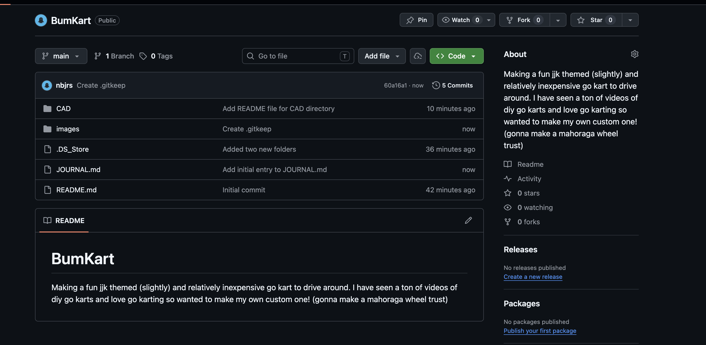

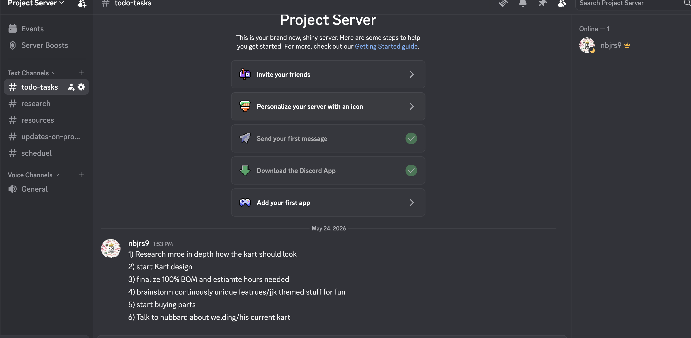

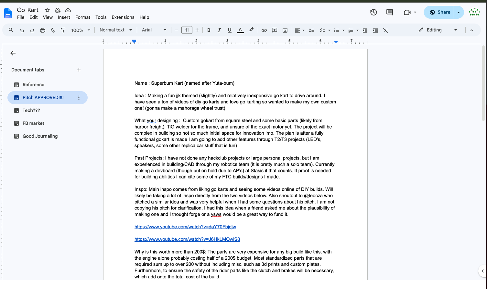

**Total time spent: 1 hour**

# May 24: Mahoraga wheel V1 made!

As promised in my project description, I am going to make the steering wheel for the kart mahoragas wheel from JJK. To make this I researched the shape and designed one that can work on onshape. It should be able to be assembled through 3d printing the balls and the rim, while cutting 20x20 mm wooden square beems the right size and painting them gold to match. The lapse link is posted below for the full 53 minute work session. My modelling was a little sketchy but also I want it to work IRL so I had to do some thinking on how feasible it is. Currently planning on working on the actual BOM more in depth and starting chassis design later tdy! (rounding up to 1 hr of time cause i had at least like 10 minutes of setting up stuff before I started design).

https://lapse.hackclub.com/timelapse/PFCDxZ44ZRmn 

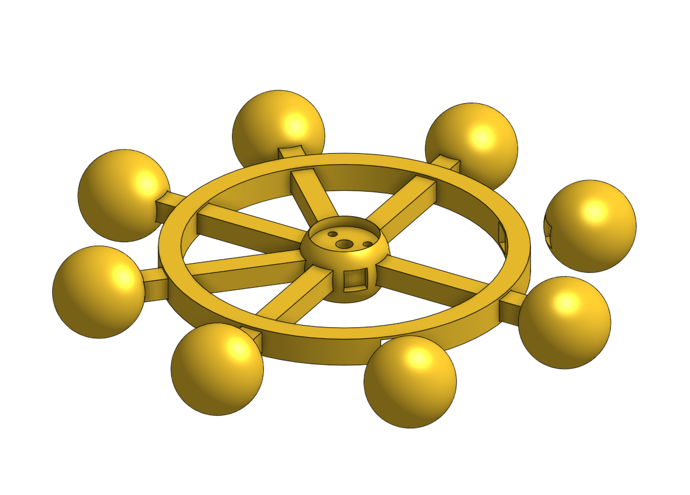

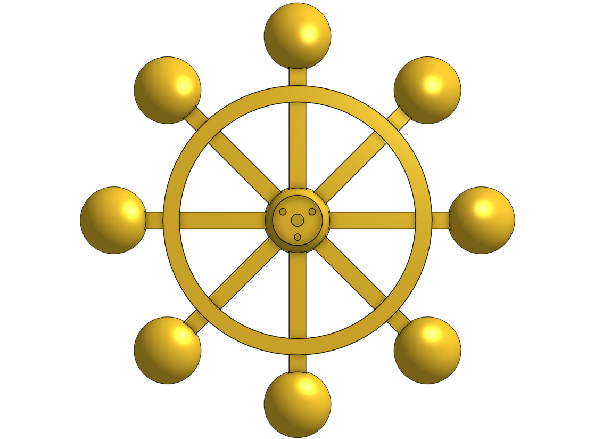

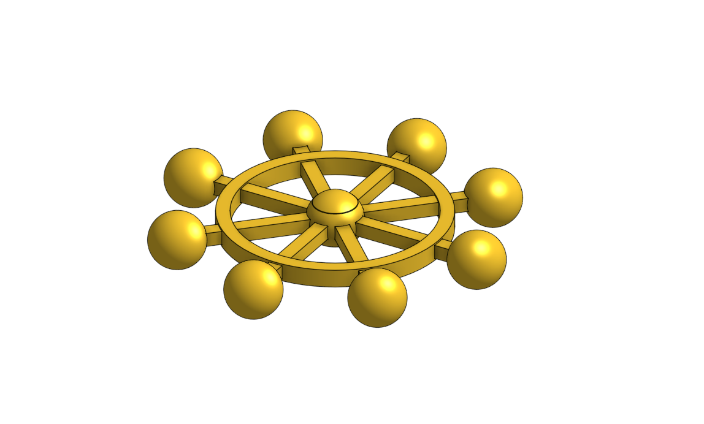

**Total time spent: 1 hour**

# May 24: GoKart Cad started! GALVANIZED SQUARE STEEL!!!

AND ECO FRIENDLY WOOD VENEERS (not). Just realized I am using galvanized square steel for the frame which didn't click before and now that it did I find it so funny. The main part of this CAD session was the start of the actual gokart CAD. I went over all of my resources and worked based off of the following todo list I made to start.

1)Import engine cad
2)Create a part studio for customisable square beams of diff size
3)Get an idea of overall shape, will I keep it a square or not?
4)Get all ordering parts that are important (wheels/others) into the cad(either designing or importing)
5)Start making mounting for the steering support beam for both sides (decide what filament later)

(Added later at the end)
6)Make custom corner magnets for welding???? (same as in video)

Based on this todo list I worked on my onshape file, where I couldn't do step 1 (I tried but the file was a scan and sucked badly) and went onto step 2. I learned how to do configurations with specific dimensions which I hadn't done before in onshape (only had done a list dropdown) and applied that to the square beam file. 

From there I decided that I am GOING to keep the rectangular shape (for now) as it is the most simple and I don't have the resources to make a really cool custom shaped frame due to cost. This shape is also heavily dependent on cost as well, because if I can get a lower cost frame or lets say use a harbor freight lifting cart as the frame then I will scrap this.

I tried to get some parts of the kart imported but I could only find the cad for the wheels as I priotitized prime shipping/cost for most parts. May have to change parts to some aliexpress ones if there are cad files or documentation. I did not get to task 5 or 6 as it is pretty late but will get on those ASAP tmrw.

I had a lot of great ideas of next steps when designing even though I got stuck at some points, and the main ones are to make a custom corner magnet holder to use when welding square beams (saw it in the video but thought it would be nice to make) and also I am thinking of 3d printing or laser cutting the seat and making it adjustable using some extrusion and 3d printed parts for different people (will research adjusting seats tmrw)

Overall great CAD session and there is way more incoming (I may end up having to switch some of these parts to ones I can CAD out as well). The CAD sadly looks so basic but figuring it out was a pain.

https://lapse.hackclub.com/timelapse/_yvn_u09mdmS

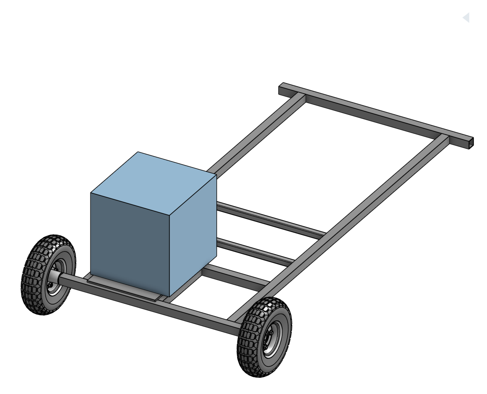

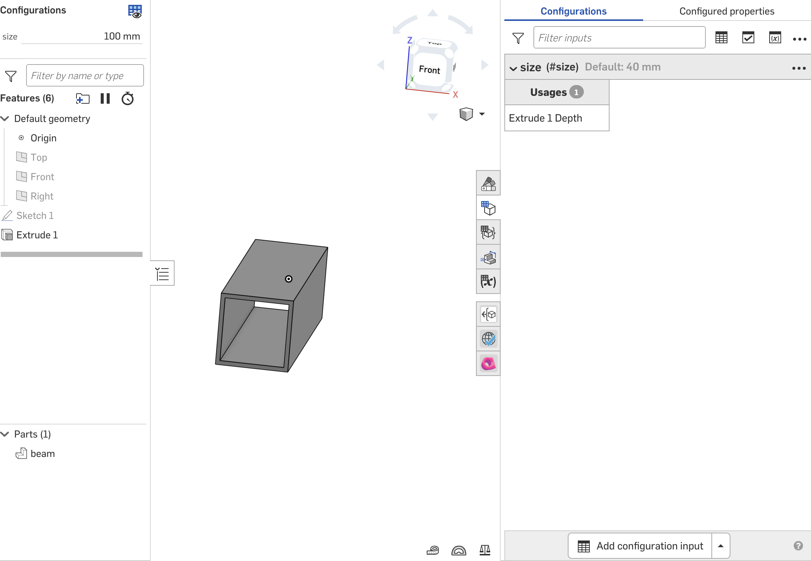

**Total time spent: 1 hour 20 minutes**

# May 25: Research + Some CAD

This session wasn't as productive as the last due to a few main issues. My main session todo list was as follows.

Current todo:
Make custom corner magnets for welding???? (same as in video)
Start making mounting for the steering support beam for both sides (decide what filament later)
Need to make a guide 3d print to get the drill press right for the bearing blocks
Make a screw generator
Start designing parts for cnc? 
Possibility of back axle? See how the bolts were welded on in the video
Watch a video of how FSAE cars are built and see if I can take some inspiration from them. 
Make a really cool led panel with some name or logo (see images for reference)

I completed the first task fairly quickly and as I already have the magnets I will probably print a few of these later this week. The second task was the main task I worked on for the rest of the time. Most of this session was spent researching other gokarts and some techniques they used. I have slowly started to realize over the course of this build that I am VERY adverse to actually welding as 1) I have never done it before and 2) I don't have easy access to someone who can do it with me. I do have a coach who can help me but it will be tedious to get his help every time I need it (likley). Most of the time was spent watching videos and also thinking about how I could actually physically mount the square beams together without welding (which I think I have some ideas but I am very scared to do. I am still trying to brainstorm the 3d prints I will use for this. I ended this build session with some good CAD work on the first two mounts that are important for the steering, and I think high infill PLA could easily be effective for these parts I made. Gonna work some more later today and still aiming for ~4 hrs a day if possible or a little less. Lapse also seems to have bugged as it only says 32 minutes while I have a screenshot of onshape with 1:20 of editing. I posted it below, I think the error happened as I did leave the lapse going for an extra 5 or so minutes before I forgot so I think when I tried cutting it out I cut the full lapse by a lot. Screenshots below of first edit, last edit, and the full list of edits in between the two for proof.

https://lapse.hackclub.com/timelapse/rKBFdCeo6Z3s 

First edit according to onshape edit history.

Last edit according to onshape edit history.

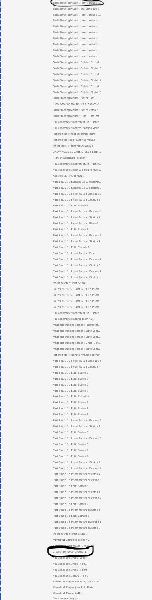

Overall edit list from onshape.

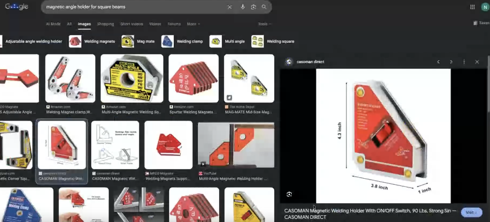

Corner reference image.

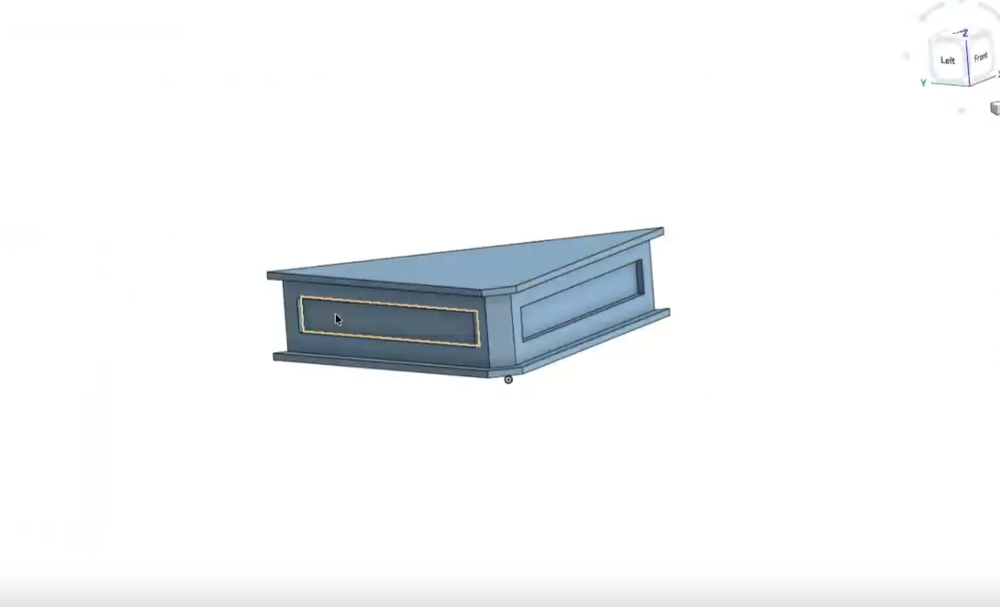

3d Cad for my corner made.

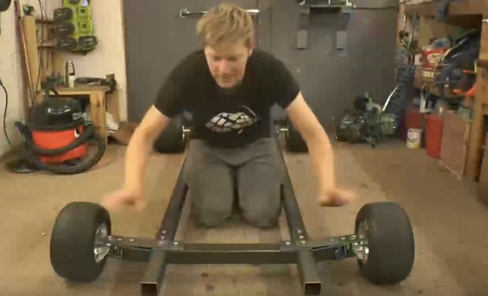

Video I watched for some more inspiration.

**Total time spent: 1 hour 10 minutes**

# May 26: Research/Brainstorm with Coach

Though we actually talked for an hours, I am not going to add it fully because the conversation was interuptted a few times and I'm not even sure stuff like this should be tracked (will ask later). School was back in today so I went over to my FTC coach/engineering professor who has made gokarts before and has lots of welding experience. I showed him my current design and he gave me a lot of good tips. Mainly ideas on how to mount the square beams without welding, however he strongly was opposed to me using 3d prints. He said it was a bad idea and due to the simplicity of the frame we could easily weld it without much effort. I also got to ask him about my motor choice/what he thought about the usage of aluminum extrusion to support the seat (as I want to save cost/steel extrusion as much as possible) and he approved both saying that they were simple and the aluminum should be enough. Going to do a few lapses where I will hopefully start the seat design today.

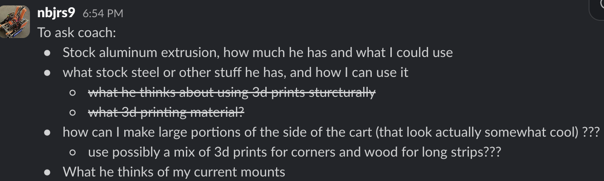
todo list and things asked (all of the 3d print stuff rejected almost instantly but that is fair lol)

**Total time spent: 30 minutes**

# May 26: BIG PROGRESS Cad session

A lot done here and I am going to keep this journal shorter as I want to sleep early. I brainstormed a ton of new ideas for the kart today, but mainly worked on the CAD. I was able to model out a brake line holder, tie rod connecting plate, an estimated CAD for the pillow block, steering axle, and some 3d printed mounts for supporting the steering axle. The kart is becoming much more defined and I am going to keep brainstorming how the full assembly will come together. At the end of the session I spent around 5-10 minutes brainstorming how a compression-spring brake pedal would work as I want a smooth feel for the pedals on the front. Below was the todo-list for the session and I will say what got done.

Current todo:
Need to make a guide 3d print to get the drill press right for the bearing blocks
Start designing parts for cnc? Only really need steel at the end of the shaft
Research new Shaft
Design bearing blocks
Design brake line holder
Design pedals 
    Lots of research needed to do this part 3d print
Make a screw generator (figure out home depot screws)
Start designing seat and seat movement mechanism
      Seat will be out of some laser cut panels probably? Maybe similar to that youtube short you watched?
       Adjusting mechanism along extrusion

Tasks 1-5 were finsished, and 6-8 will hopefully be completed or worked on next session (likley just started but I can only hope lmao). Lapse is below.

https://lapse.hackclub.com/timelapse/rJRCKR5qocof 

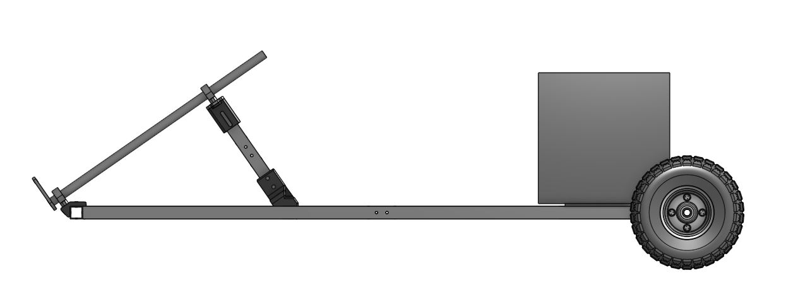

Side-view of current Kart CAD. New 3d printed mounts visible.

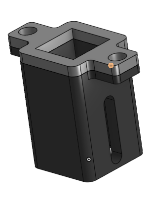

Beam mount with a 1/4 in steel plate for pillow block support.

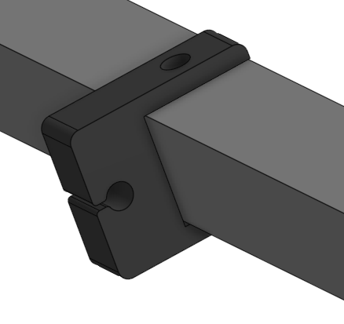

Simple brake line guide based on the inspiration video/not steel laser cut though.

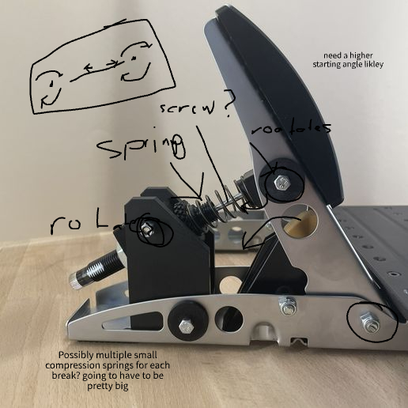

Found a useful reference pedal image and tried to break (funny pun lmao) it down for myself to understand how I could make this work with 3d prints and some springs, going to need to use some aluminum I am guessing to make this rigid enough.

**Total time spent: 1 hour 31 minutes**

# May 27: Mid School Lock IN
I guess we do forge in school now? Didn't do as much this session as it was pretty short but mainly made screw geneators and washer generators, using home depot screws and washers as reference. Made it all configurable and then added it to the CAD for accuracy and for confirming that there was no interference in bolts. Found that in the front mount their was interference and fixed it. It also makes the CAD look very nice and more accurate! Lapse below, and only finished the task to make the screw generator (washers added)

https://lapse.hackclub.com/timelapse/3G97GEaR7kho

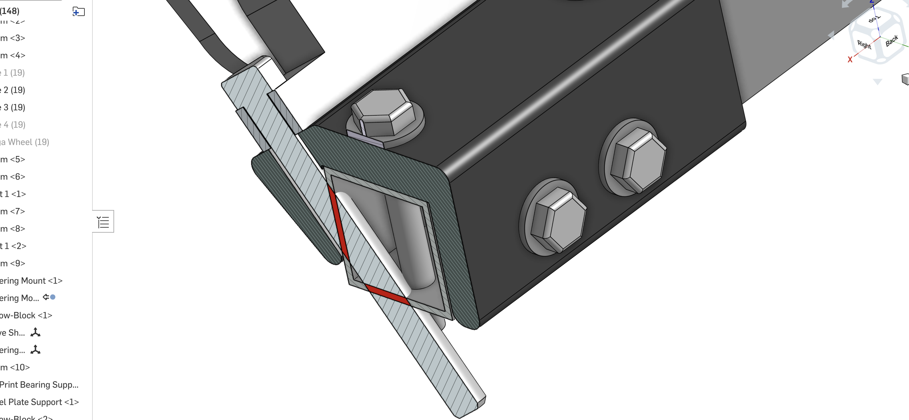

Interference problem mentioned in the journal.

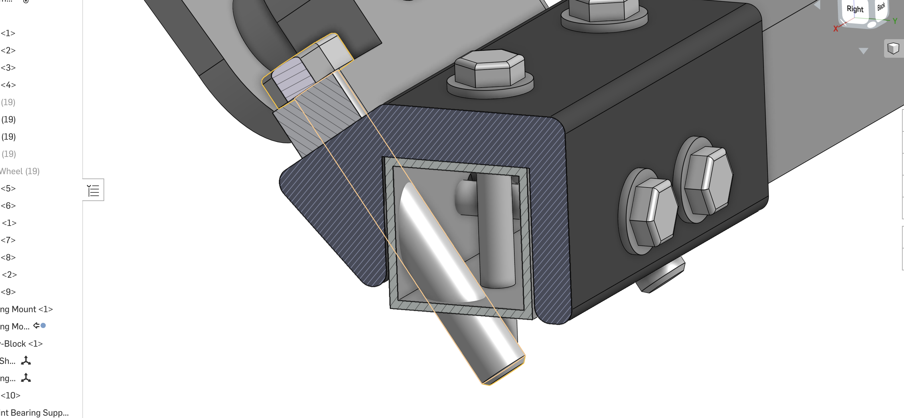

After fixing interference problem!

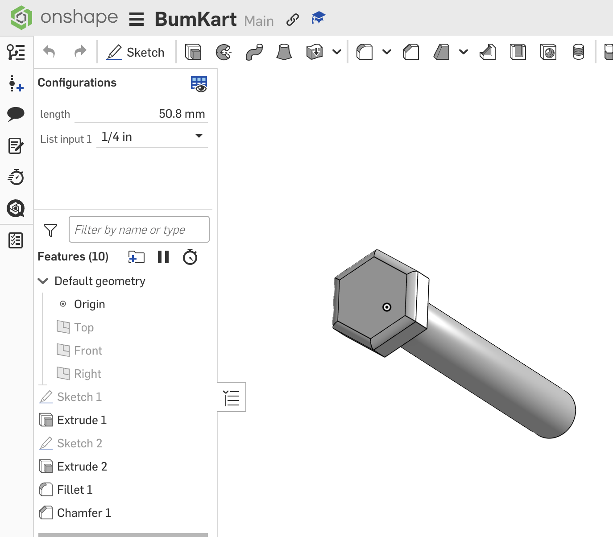

Cool screw gen I made (see onshape and I may make it avaliable but it is only two screw types lol)

**Total time spent: 31 minutes**

# May 27: Some more school stuff + Brake Start!

This session started where I realized some issues with interference again. I realized that there was slight interference with the screws in the CAD but more importantly I wanted to adress my ever growing nag that the steering axle wasn't aligned! I couldn't figure out why as I had rechecked the CAD at least 2-3 times, and found that the fasten mate just wasn't properly done for the front mount. I fixed it and then the drive shaft was actually aligned! Horray! After a ton of delay I finnaly started the process of making the pedals! I was taking inspiration from a spring-compression based pedal for sim racing, and due to the fact that the motor will have little to no resistance inherintley as this is a gokart with hobby parts, I wanted to make a nice sleak design that is fun to use. My design process was as follows.

1) I started with a reference box-tube, same as previous parts. I modeled around it to make it accurate and usable on the real kart
2) I then started to plan how I wanted the spacing to work, where the actual pivot would go for the brake pedal and where the guide for the brake compression would go (idea based on the sideview picture I was blessed with in a previous session)
3) From there I made aluminum 1/8 plates for support, and placed holes for furhter reinforcement of the main bulk (the 3d print)

After finishing up and making the pedal outline/aluinum and 3d print parts I ended this session. Overall some good progress and the pedals are gonna be a huge effort to make work, even in CAD. They seem fun and already look nice though so I'm hyped!

https://lapse.hackclub.com/timelapse/ZvHaCkugiypZ

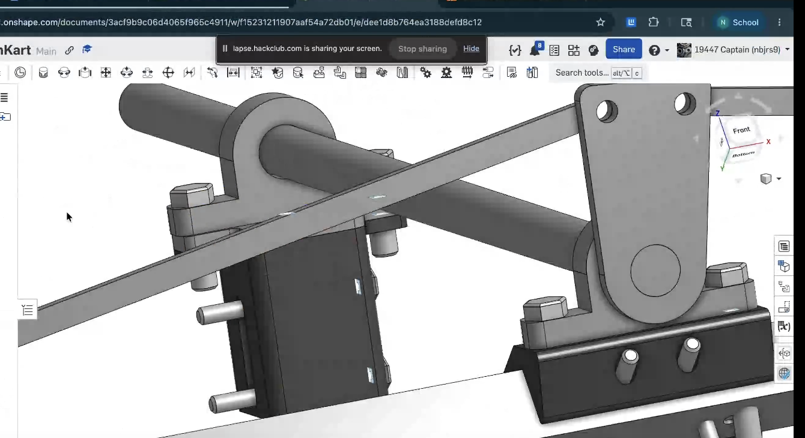

Steering axle lines up with the base, AMAZE AMAZE!

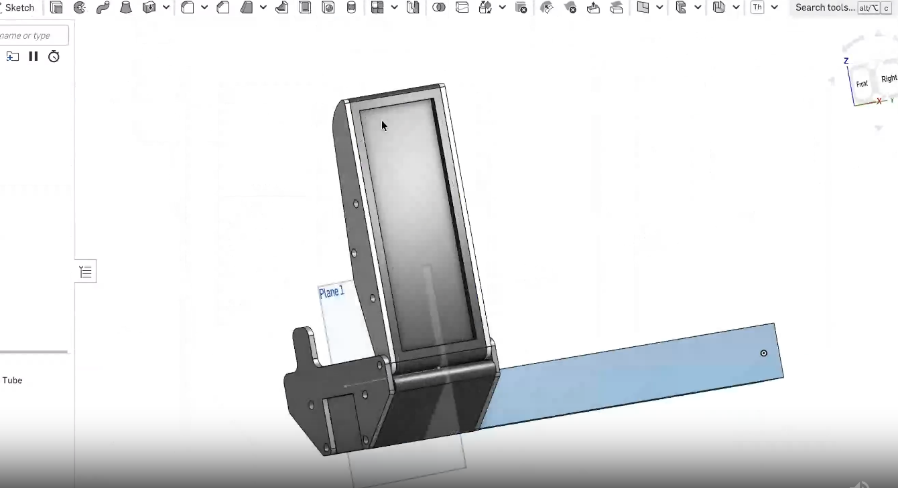

Incomplete pedal design from this session.

**Total time spent: 41 minutes**

# May 27: BRAKE FINISHED GRINDDDDD

I haven't been hitting my personal goals for how much time per day I work on this kart, but today definitely was a good step in the right direction. After chilling at the beach with friends for 5 hrs or so, I came back home and grinded out the break for 1.5 hrs more. This took a lot and I have a lot of steps I took to complete this part of the kart. First off, I wanted to make the pedals very grippy for riding and so your feet don't slip off, as I have done gokarting before and that has been a problem. To solve this, I am going to use my past experience with polyurethane molds and designed a cool looking rubber peice that will be used for extra friciton on the pedals (will decide the color later). I later created a mold which I will use to make the rubber peices, and I actually implemented a new feature!

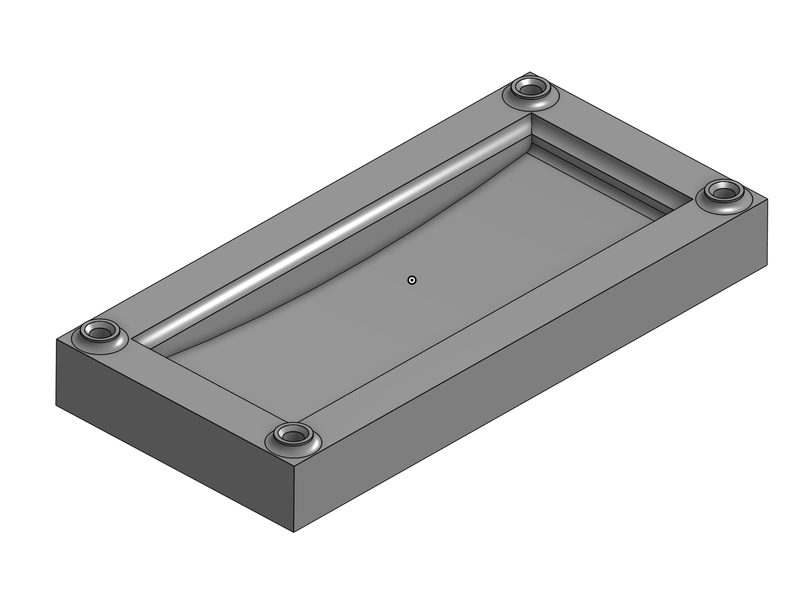

(in text images a new one for me lol) So what I did was make a fillet lip so any excess polyurethane doesn't leak out but rather stays trapped in the mold area. This will be huge as I can also somewhat overfill the mold to make sure there is no dip in the mold later. 

After this I went on to design the most annoying part of this whole pedal system, the aligning spring holders! I used the image in the previous journal (which helped me so much to think about the design) to decide to use 75 mm m4 screws as guide for the springs. The springs are connected to the two freely rotating peices in the picture below, which both rotate to stay parallel when the pedal is compressed.

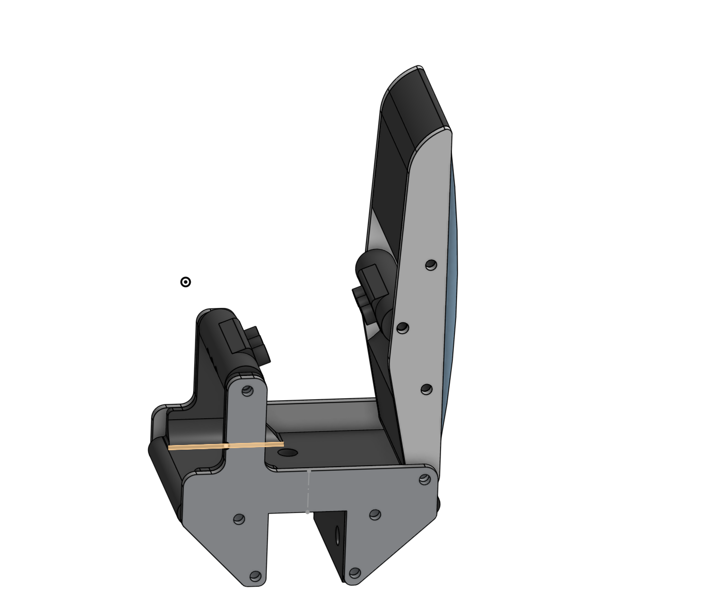

Took me a while to figure out how this would all work IRL, including my choice to use some m4 heat set inserts for certain parts (specifically to connect the 3d prints to the aluminum). 

Overall, I am really happy with the results, I got them on the kart and they look sick! May work some more on them but probably not, only once I physically make the v1 of them. Lapse is below.

https://lapse.hackclub.com/timelapse/eIQ8M-vF9ZqJ

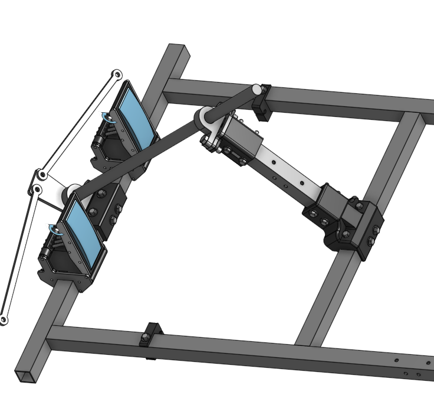

**Total time spent: 1 hour 30 minutes**
# May 28: Short Log (discussion with coach again/some design choices)

No lapse today so I am keeping the hours very short (max 30 minutes). Mainly today I talked to my robotics coach about the brake system I developed yesterday and he said it was cool and he would help me make some prototypes soon! I fixed one of the CAD problems, which was that the pedals don't have a front blocking mechanism to make sure they don't just swing all the way forwards, and I fixed that pretty quickly by extending the plates and also making a 3d printed spacer. I researched as well into what screws I will use for the brakes (75 mm m4 socket head) and what material I will use for the first prototype (acrylic and 3d prints mostly, acrylic for all the pannels or maybe some polycarb, depends what scrap we have at my schools machine shop. Will possibly design later tonight, depends on how I'm feeling as I had a pretty long day. Big progress incoming, I still need to brainstorm how tf I'm gonna make a custom seat LMAO.

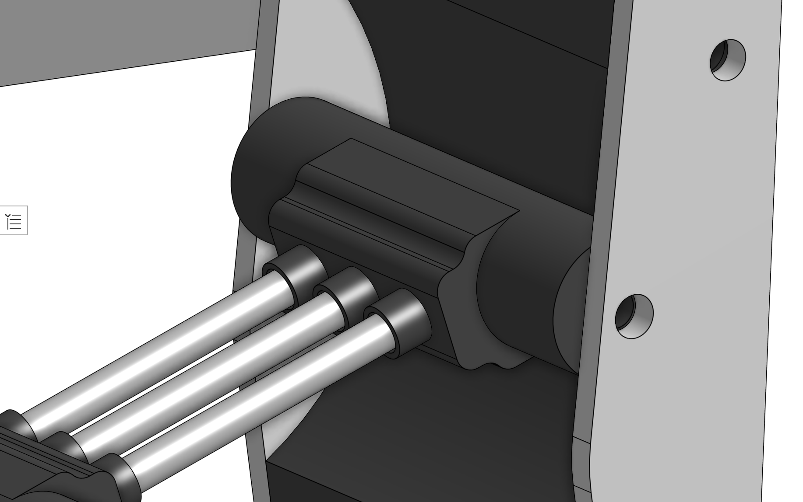

In this picture I adjusted my pedal guides to be slighty further to be able to use better springs (in image below) that are cheaper and also way more availiable. Also adjusted the diameter of the 3d printed spring holding parts (seen around the screws) to match the OD of the springs (5.8 mm for the 3d prints for the 6 mm diameter of the springs for some clearance. 

**Total time spent: 30 minutes**

